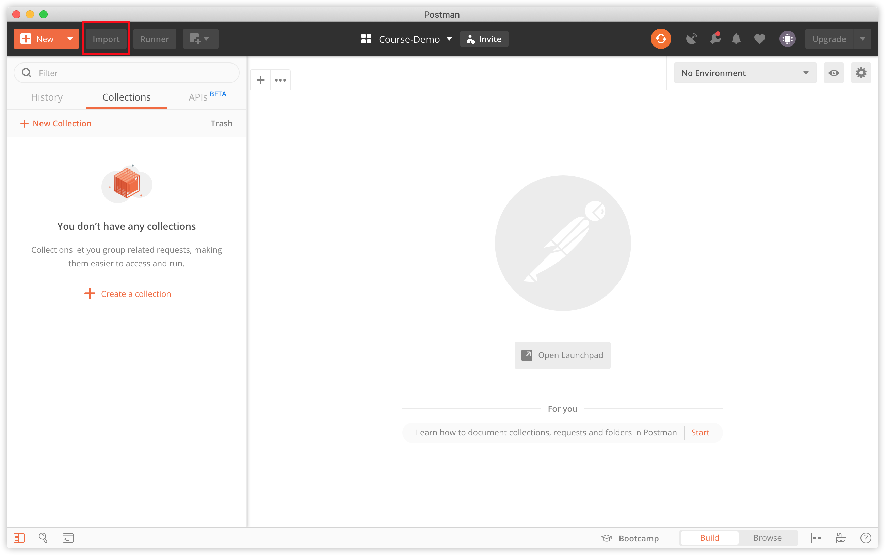
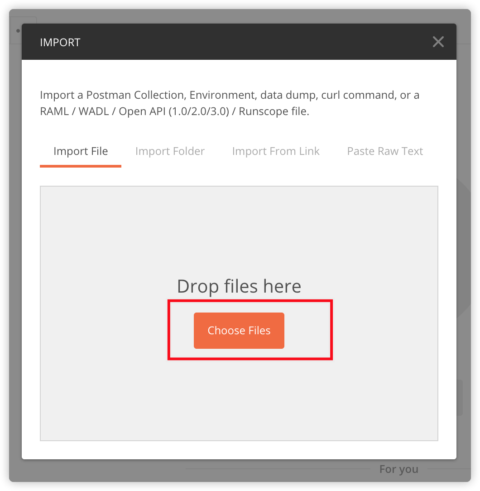
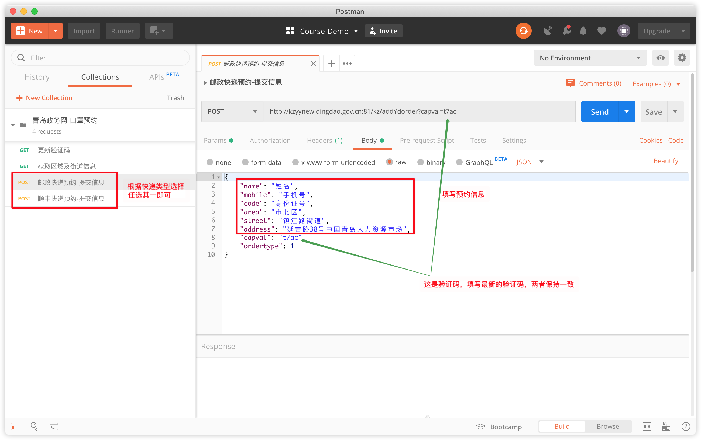
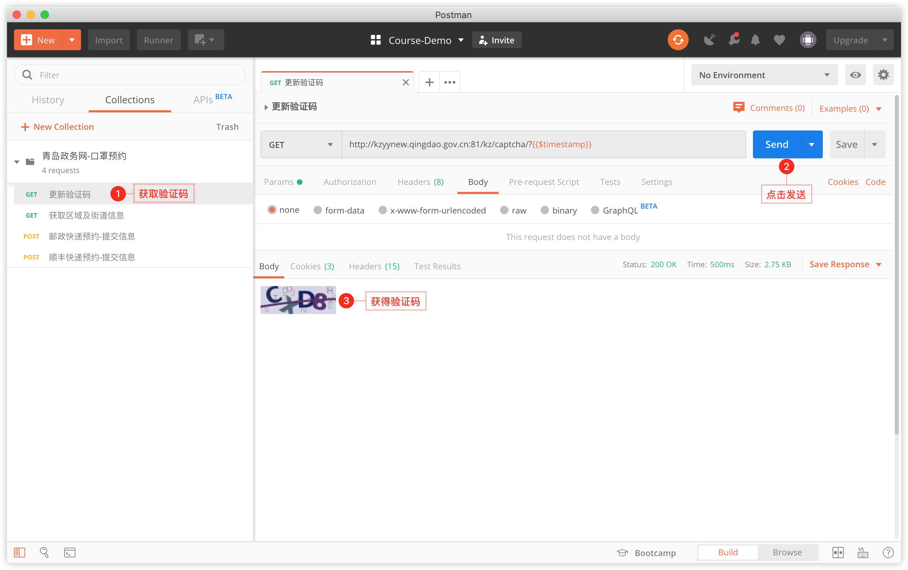
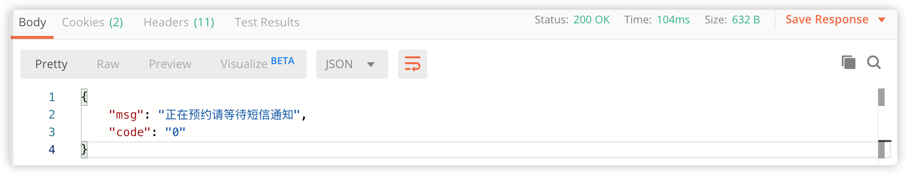

## 青岛政务网-口罩预约-接口形式

### 下载接口文件信息

[下载方式 1-json 文件](https://suremotoo.coding.net/p/qingdao-appointment-task-guide/d/qingdao-appointment-task-guide/git/raw/master/interface/青岛政务网-口罩预约.postman_collection.json)

或

[下载方式 2-解压包](https://suremotoo.coding.net/p/qingdao-appointment-task-guide/d/qingdao-appointment-task-guide/git/raw/master/interface/%E8%A7%A3%E5%8E%8B%E6%AD%A4%E6%96%87%E4%BB%B6.zip)

### 导入接口信息

打开 **Postman**，点击左上角 **import** 按钮

点击 **Choose Files**，选择 **青岛政务网-口罩预约.postman_collection.json** 文件

导入成功后，根据快递类型，打开对应的提交信息接口，先将预约信息都填写好，<b><u>不要提交</u></b>

提交预约信息页

获取验证码，并补充提交信息服务

提交预约信息前，要先调用更新验证码服务，获取更新验证码服务的时候不要在规定时间的整时间刻，比如：9.30 分开始，不要在 9.30 分 0 秒获取，要再晚个 5 、6 秒去获取。

如果接口会返回 **正在预约请等待短信通知** ，基本上就预约成功了

最后我们可以去 http://kzyynew.qingdao.gov.cn:81/authPage/searchPage 网站查询是否成功

### 含义解释表

| 单词    |   解释   |   备注   |
| ------ | ---- | ---- |
| name |   姓名   |      |
| mobile | 手机号 | |
| code | 身份证号 | |
| area | 所在区划 | 如：市南区、市北区 |
| street | 所在街道 | 如：镇江路街道|
| address | 快递收货详细地址 |  |
| capval | 验证码 |  |
| ordertype | 快递形式 | 1：邮政  2：顺丰 该值对应不同的请求地址 |

### 地区及街道列表

#### 市南区
| 地区 | 街道 |
| ------ | ---- |
| 市南区 | 中山路街道办事处 |
| 市南区 | 八大关街道办事处 |
| 市南区 | 珠海路街道办事处 |
| 市南区 | 八大峡街道办事处 |
| 市南区 | 云南路街道办事处 |
| 市南区 | 湛山街道办事处 |
| 市南区 | 江苏路街道办事处 |
| 市南区 | 金门路街道办事处 |
| 市南区 | 八大湖街道办事处 |
| 市南区 | 香港中路街道办事处 |
| 市南区 | 金湖路街道办事处 |

#### 市北区
| 地区 | 街道 |
| ------ | ---- |
| 市北区 | 大港街道办事处 |
| 市北区 | 湖岛街道办事处 |
| 市北区 | 水清沟街道办事处 |
| 市北区 | 镇江路街道办事处 |
| 市北区 | 海伦路街道办事处 |
| 市北区 | 洛阳路街道办事处 |
| 市北区 | 合肥路街道办事处 |
| 市北区 | 浮山新区街道办事处 |
| 市北区 | 延安路街道办事处 |
| 市北区 | 台东街道办事处 |
| 市北区 | 阜新路街道办事处 |
| 市北区 | 四方街道办事处 |
| 市北区 | 宁夏路街道办事处 |
| 市北区 | 敦化路街道办事处 |
| 市北区 | 辽源路街道办事处 |
| 市北区 | 河西街道办事处 |
| 市北区 | 即墨路街道办事处 |
| 市北区 | 辽宁路街道办事处 |
| 市北区 | 兴隆路街道办事处 |
| 市北区 | 双山街道办事处 |
| 市北区 | 登州路街道办事处 |

#### 李沧区
| 地区 | 街道 |
| ------ | ---- |
| 李沧区 | 世园街道办事处 |
| 李沧区 | 楼山街道办事处 |
| 李沧区 | 九水街道办事处 |
| 李沧区 | 湘潭路街道办事处 |
| 李沧区 | 兴华路街道办事处 |
| 李沧区 | 振华路街道办事处 |
| 李沧区 | 虎山路街道办事处 |
| 李沧区 | 兴城路街道办事处 |
| 李沧区 | 沧口街道办事处 |
| 李沧区 | 李村街道办事处 |
| 李沧区 | 浮山路街道办事处 |

#### 崂山区
| 地区 | 街道 |
| ------ | ---- |
| 崂山区 | 沙子口街道办事处 |
| 崂山区 | 金家岭街道办事处 |
| 崂山区 | 王哥庄街道办事处 |
| 崂山区 | 中韩街道办事处 |
| 崂山区 | 北宅街道办事处 |

#### 青岛西海岸新区
| 地区 | 街道 |
| ------ | ---- |
| 青岛西海岸新区 | 青岛西海岸新区泊里镇 |
| 青岛西海岸新区 | 青岛西海岸新区薛家岛街道 |
| 青岛西海岸新区 | 青岛西海岸新区滨海街道 |
| 青岛西海岸新区 | 青岛西海岸新区黄岛街道 |
| 青岛西海岸新区 | 青岛西海岸新区灵山岛省级自然保护区 |
| 青岛西海岸新区 | 青岛西海岸新区临港经济区 |
| 青岛西海岸新区 | 青岛西海岸新区灵山卫街道 |
| 青岛西海岸新区 | 青岛西海岸新区宝山镇 |
| 青岛西海岸新区 | 青岛西海岸新区隐珠街道 |
| 青岛西海岸新区 | 青岛西海岸新区珠海街道 |
| 青岛西海岸新区 | 青岛西海岸新区藏南镇 |
| 青岛西海岸新区 | 青岛西海岸新区大村镇 |
| 青岛西海岸新区 | 青岛西海岸新区海青镇 |
| 青岛西海岸新区 | 青岛西海岸新区琅琊镇 |
| 青岛西海岸新区 | 青岛西海岸新区六汪镇 |
| 青岛西海岸新区 | 青岛西海岸新区王台镇 |
| 青岛西海岸新区 | 青岛西海岸新区张家楼镇 |
| 青岛西海岸新区 | 青岛西海岸新区红石崖街道 |
| 青岛西海岸新区 | 青岛西海岸新区长江路街道 |
| 青岛西海岸新区 | 青岛西海岸新区胶南街道办事处 |
| 青岛西海岸新区 | 青岛西海岸新区灵珠山街道 |
| 青岛西海岸新区 | 青岛西海岸新区铁山街道 |
| 青岛西海岸新区 | 青岛西海岸新区辛安街道 |
| 青岛西海岸新区 | 青岛西海岸新区大场镇 |

#### 城阳区
| 地区 | 街道 |
| ------ | ---- |
| 城阳区 | 夏庄街道办事处 |
| 城阳区 | 棘洪滩街道办事处 |
| 城阳区 | 惜福镇街道办事处 |
| 城阳区 | 上马街道办事处 |
| 城阳区 | 流亭街道办事处 |
| 城阳区 | 城阳街道办事处 |
| 城阳区 | 河套街道办事处 |
| 城阳区 | 红岛街道办事处 |

#### 即墨区
| 地区 | 街道 |
| ------ | ---- |
| 即墨区 | 鳌山卫街道办事处 |
| 即墨区 | 潮海街道办事处 |
| 即墨区 | 龙泉街道办事处 |
| 即墨区 | 即墨区田横镇 |
| 即墨区 | 通济街道办事处 |
| 即墨区 | 温泉街道办事处 |
| 即墨区 | 环秀街道办事处 |
| 即墨区 | 北安街道办事处 |
| 即墨区 | 龙山街道办事处 |
| 即墨区 | 即墨区大信镇 |
| 即墨区 | 即墨区蓝村镇 |
| 即墨区 | 移风店镇 |
| 即墨区 | 即墨区金口镇 |
| 即墨区 | 即墨区灵山镇 |
| 即墨区 | 通济新经济区 |
| 即墨区 | 段泊岚镇 |

#### 胶州市
| 地区 | 街道 |
| ------ | ---- |
| 胶州市 | 胶州市李哥庄镇 |
| 胶州市 | 胶州市胶莱街道办事处 |
| 胶州市 | 胶州市胶西街道办事处 |
| 胶州市 | 胶州市里岔镇 |
| 胶州市 | 胶州市洋河镇 |
| 胶州市 | 胶州市铺集镇 |
| 胶州市 | 胶州市九龙街道办事处 |
| 胶州市 | 胶州市阜安街道办事处 |
| 胶州市 | 胶州市中云街道办事处 |
| 胶州市 | 胶州市三里河街道办事处 |
| 胶州市 | 胶州市胶东街道办事处 |
| 胶州市 | 胶州市胶北街道办事处 |

#### 平度市
| 地区 | 街道 |
| ------ | ---- |
| 平度市 | 平度市开发区管委 |
| 平度市 | 平度市古岘镇 |
| 平度市 | 平度市田庄镇 |
| 平度市 | 平度市新河镇 |
| 平度市 | 平度市仁兆镇 |
| 平度市 | 平度市东阁街道办事处 |
| 平度市 | 平度市白沙河街道办事处 |
| 平度市 | 平度市南村镇 |
| 平度市 | 平度市崔家集镇 |
| 平度市 | 平度市明村镇 |
| 平度市 | 平度市大泽山镇 |
| 平度市 | 平度市凤台街道办事处 |
| 平度市 | 平度市同和街道办事处 |
| 平度市 | 平度市李园街道办事处 |
| 平度市 | 平度市店子镇 |
| 平度市 | 平度市旧店镇 |
| 平度市 | 平度市云山镇 |
| 平度市 | 平度市蓼兰镇 |

#### 莱西市
| 地区 | 街道 |
| ------ | ---- |
| 莱西市 | 莱西市马连庄镇 |
| 莱西市 | 莱西市沽河街道办事处 |
| 莱西市 | 莱西市院上镇 |
| 莱西市 | 莱西市夏格庄镇 |
| 莱西市 | 莱西市望城街道办事处 |
| 莱西市 | 莱西市日庄镇 |
| 莱西市 | 莱西市南墅镇 |
| 莱西市 | 莱西市店埠镇 |
| 莱西市 | 莱西市河头店镇 |
| 莱西市 | 莱西市经济开发区 |
| 莱西市 | 莱西市姜山镇 |
| 莱西市 | 莱西市水集街道办事处 |

